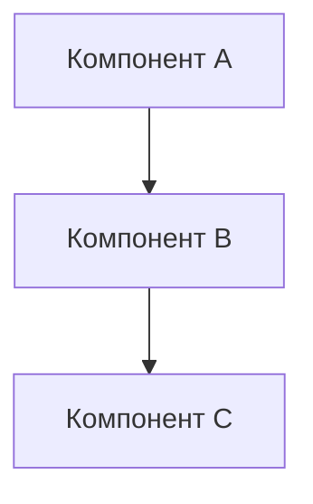

# [Название концепции]

> **Тип:** Concept  
> **Цель:** Объяснить, как и почему что-то работает  
> **Аудитория:** [Разработчики / Архитекторы / Все]

## Обзор

Краткое описание концепции (1-2 абзаца).

## Проблема

Какую проблему решает эта концепция?

## Решение

Как решается проблема?

### Архитектура



### Компоненты

1. **Компонент 1** — описание роли и ответственности
2. **Компонент 2** — описание роли и ответственности

## Как это работает

Пошаговое объяснение работы системы:

1. Шаг 1
2. Шаг 2
3. Шаг 3

## Преимущества

- Преимущество 1
- Преимущество 2

## Ограничения

- Ограничение 1
- Ограничение 2

## Примеры использования

```typescript
// Пример кода
import { useConcept } from "@/lib/hooks/useConcept";

function Example() {
  const { data } = useConcept();
  return <div>{data}</div>;
}
```

## См. также

- [Связанное руководство](../guides/related.md)
- [Связанный справочник](../reference/related.md)
- [Целевая архитектура](../concepts/target-architecture.md)
