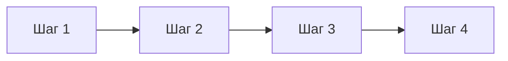

# [Название процесса]

> **Тип:** Process  
> **Цель:** Описать процесс или стандарт команды  
> **Аудитория:** [Все разработчики]

## Обзор

Краткое описание процесса и его цели.

## Зачем это нужно

Объяснение, почему этот процесс важен:

- Причина 1
- Причина 2
- Причина 3

## Правила

### Правило 1

Описание правила и примеры.

**Хорошо:**

```
Пример правильного использования
```

**Плохо:**

```
Пример неправильного использования
```

### Правило 2

Описание правила и примеры.

## Workflow



### Шаг 1: [Название]

Описание шага.

### Шаг 2: [Название]

Описание шага.

### Шаг 3: [Название]

Описание шага.

## Исключения

Когда можно отступить от процесса:

- Исключение 1
- Исключение 2

## Инструменты

| Инструмент | Назначение |
| ---------- | ---------- |
| Tool 1     | Описание   |
| Tool 2     | Описание   |

## FAQ

### Вопрос 1?

Ответ на вопрос.

### Вопрос 2?

Ответ на вопрос.

## См. также

- [Связанное руководство](../guides/related.md)
- [Связанный процесс](./related-process.md)
