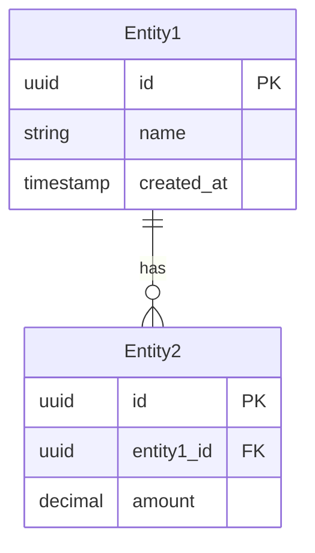

# Модуль: [Название]

> **Статус:** [Planning / In Progress / Done / Stub]  
> **Приоритет:** [High / Medium / Low]  
> **Зависимости:** [Другие модули, если есть]

## Обзор

Краткое описание модуля и его назначения (2-3 предложения).

## Цели

- Основная цель 1
- Основная цель 2
- Основная цель 3

## Scope

### В scope

- Функциональность 1
- Функциональность 2
- Функциональность 3

### Вне scope (для будущих версий)

- Функциональность X
- Функциональность Y

## User Stories

### US-001: [Название истории]

**Как** [роль пользователя]  
**Я хочу** [действие]  
**Чтобы** [цель/выгода]

**Критерии приёмки:**

- [ ] Критерий 1
- [ ] Критерий 2
- [ ] Критерий 3

### US-002: [Название истории]

**Как** [роль пользователя]  
**Я хочу** [действие]  
**Чтобы** [цель/выгода]

**Критерии приёмки:**

- [ ] Критерий 1
- [ ] Критерий 2

## Модель данных

### Сущности



### Описание полей

#### Entity1

| Поле | Тип | Обязательное | Описание |
|------|-----|--------------|----------|
| id | uuid | Да | Первичный ключ |
| name | string | Да | Название |
| created_at | timestamp | Да | Дата создания |

## API / Hooks

### useModuleName

```typescript
interface UseModuleNameOptions {
  option1?: boolean;
  option2?: string;
}

interface UseModuleNameReturn {
  data: ModuleData[];
  isLoading: boolean;
  error: Error | null;
  create: (data: CreateInput) => Promise<void>;
  update: (id: string, data: UpdateInput) => Promise<void>;
  delete: (id: string) => Promise<void>;
}

const { data, isLoading, create } = useModuleName(options);
```

## UI компоненты

| Компонент | Описание | Путь |
|-----------|----------|------|
| ModuleList | Список элементов | `components/features/module/ModuleList.tsx` |
| ModuleForm | Форма создания/редактирования | `components/features/module/ModuleForm.tsx` |
| ModuleCard | Карточка элемента | `components/features/module/ModuleCard.tsx` |

## Интеграция с другими модулями

- **Модуль X**: Описание интеграции
- **Модуль Y**: Описание интеграции

## Технические заметки

- Заметка 1
- Заметка 2

## Открытые вопросы

- [ ] Вопрос 1
- [ ] Вопрос 2

## Ссылки

- [Референс из Pennora](../../reference/pennora/...)
- [Целевая архитектура](../concepts/target-architecture.md)
