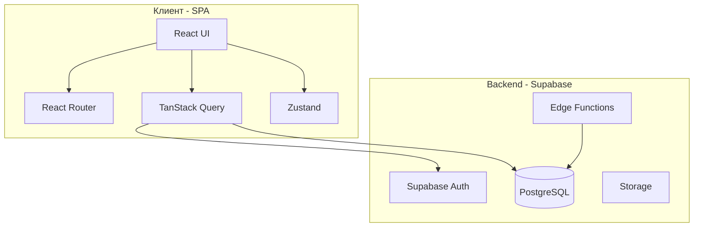
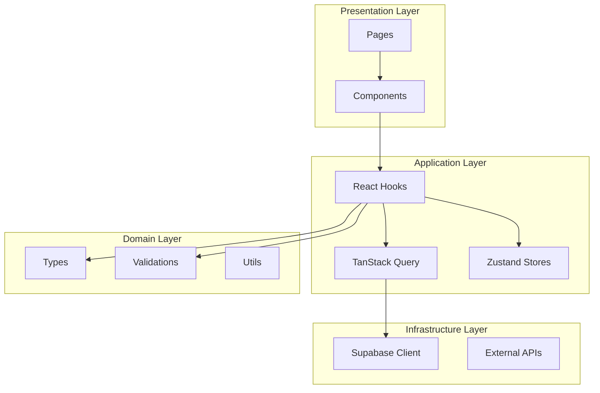
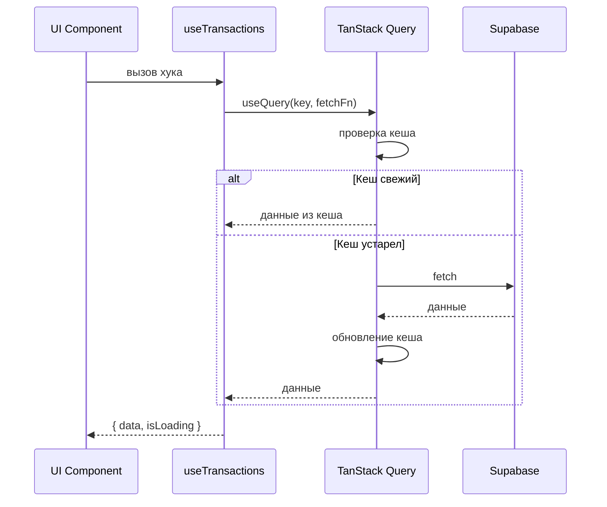
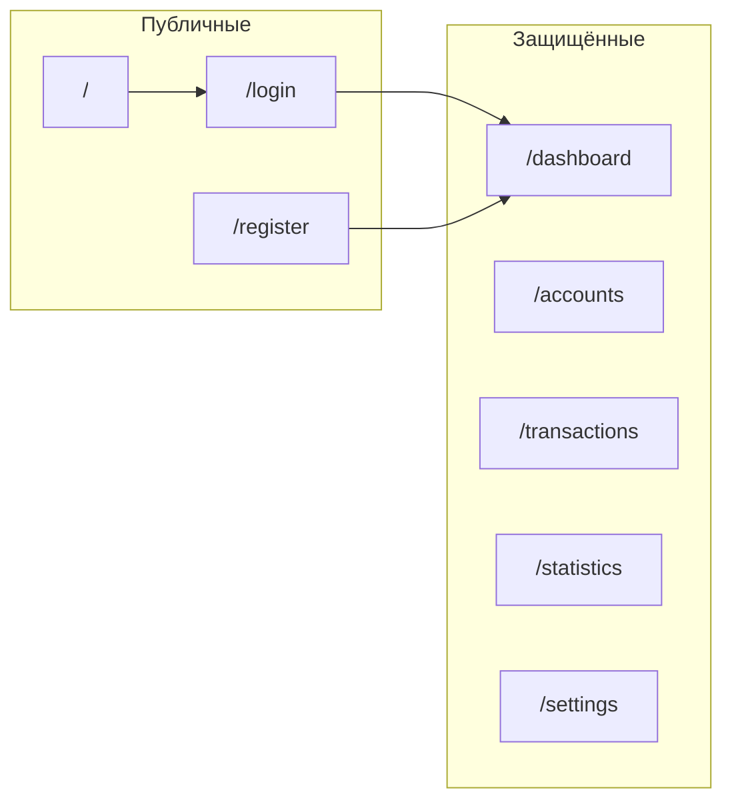
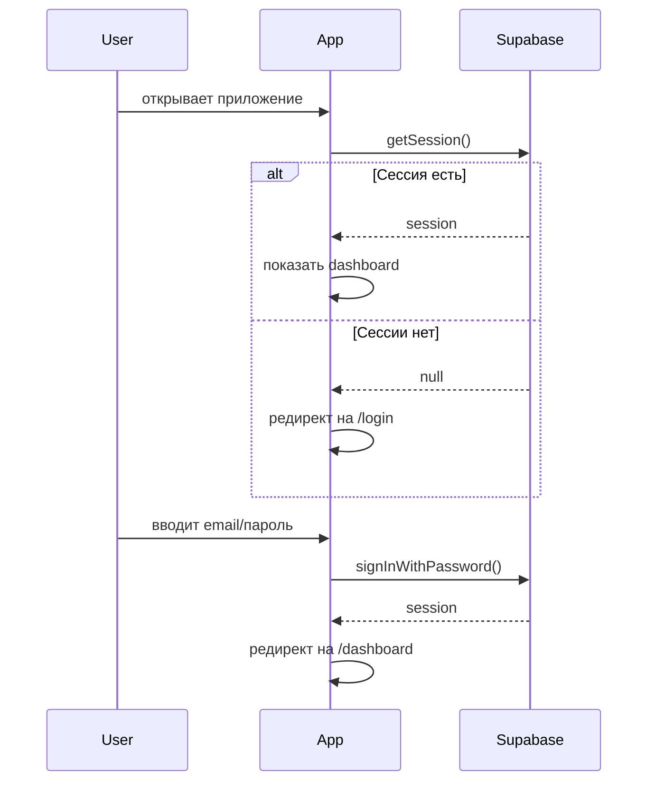

# Целевая архитектура проекта Ассистент

> **Тип:** Concept
> **Цель:** Объяснить целевую архитектуру приложения
> **Аудитория:** Разработчики

> 📋 **Это целевая архитектура проекта.**
> Текущее состояние: лендинг на Vite + React.
> Реализация по [roadmap](../meta/roadmap.md).

## Обзор

«Ассистент» — SPA-приложение на Vite + React для управления финансами, здоровьем, списками и семейным режимом. Архитектура оптимизирована для быстрой навигации и масштабируемости.

## Почему SPA, а не SSR?

Выбор SPA (Vite + React) вместо SSR (Next.js) обусловлен:

1. **Всё под авторизацией** — SEO не нужен для дашборда
2. **Быстрые переходы** — клиентская навигация без серверных раундтрипов
3. **Проще деплой** — статика на любом хостинге
4. **Меньше оверхеда** — нет гидрации, нет серверных компонентов

Подробнее: [ADR-0001: Выбор Vite SPA](../meta/adr/0001-vite-spa.md)

## Высокоуровневая архитектура



## Структура проекта

```
assistant/
├── src/
│   ├── components/           # React компоненты
│   │   ├── ui/               # Базовые UI (Button, Input, etc.)
│   │   ├── features/         # Компоненты по модулям
│   │   │   ├── finance/
│   │   │   ├── health/
│   │   │   ├── assistant/
│   │   │   └── family/
│   │   ├── landing/          # Лендинг
│   │   ├── layouts/          # Layout компоненты
│   │   └── motion/           # Анимации
│   │
│   ├── pages/                # Страницы (роуты)
│   │   ├── landing/
│   │   ├── auth/
│   │   ├── dashboard/
│   │   └── settings/
│   │
│   ├── lib/                  # Библиотеки и утилиты
│   │   ├── db/               # Supabase клиент
│   │   ├── query/            # TanStack Query (hooks, keys)
│   │   ├── hooks/            # Общие React hooks
│   │   ├── stores/           # Zustand stores
│   │   ├── types/            # TypeScript типы
│   │   ├── validations/      # Zod схемы
│   │   └── utils/            # Утилиты (cn, formatters)
│   │
│   ├── providers/            # React провайдеры
│   │   ├── theme-provider.tsx
│   │   └── query-provider.tsx
│   │
│   ├── App.tsx               # Главный компонент с роутами
│   ├── main.tsx              # Точка входа
│   └── index.css             # Глобальные стили
│
├── public/                   # Статические файлы
├── docs/                     # Документация
└── reference/                # Референс (Pennora)
```

## Слои приложения



### Presentation Layer

- **Pages** — страницы приложения, соответствуют роутам
- **Components** — UI компоненты, разделённые на:
  - `ui/` — базовые компоненты (Button, Input)
  - `features/` — бизнес-компоненты по модулям
  - `layouts/` — layout компоненты

### Application Layer

- **React Hooks** — переиспользуемая логика (`useAccounts`, `useTransactions`)
- **TanStack Query** — серверное состояние, кеширование, мутации
- **Zustand Stores** — клиентское состояние (UI, auth)

### Domain Layer

- **Types** — TypeScript типы и интерфейсы
- **Validations** — Zod схемы для валидации
- **Utils** — чистые функции (форматирование, вычисления)

### Infrastructure Layer

- **Supabase Client** — взаимодействие с БД и Auth
- **External APIs** — курсы валют, etc.

## Поток данных



### Чтение данных

1. Компонент вызывает hook (`useTransactions`)
2. Hook использует `useQuery` из TanStack Query
3. Query проверяет кеш:
   - Если данные свежие → возврат из кеша
   - Если устарели → запрос к Supabase
4. Данные возвращаются в компонент

### Запись данных (мутации)

1. Компонент вызывает мутацию (`createTransaction`)
2. **Оптимистичное обновление** — UI обновляется сразу
3. Запрос к Supabase
4. При успехе — инвалидация связанных кешей
5. При ошибке — откат оптимистичного обновления

## Маршрутизация



### Публичные маршруты

- `/` — лендинг
- `/login` — вход
- `/register` — регистрация

### Защищённые маршруты

Требуют авторизации:

- `/dashboard` — главная страница с балансом
- `/accounts` — управление счетами
- `/transactions` — история транзакций
- `/statistics` — статистика
- `/categories` — управление категориями
- `/settings` — настройки

## State Management

### Серверное состояние (TanStack Query)

Данные из Supabase:

- Счета
- Транзакции
- Категории
- Профиль пользователя

**Особенности:**

- Автоматическое кеширование
- Background refetch
- Оптимистичные обновления
- Инвалидация при мутациях

### Клиентское состояние (Zustand)

Локальное состояние:

- UI состояние (модалки, сайдбары)
- Состояние авторизации
- Настройки темы

## Аутентификация



## Темы

- Поддержка светлой, тёмной, системной темы
- CSS переменные в `index.css`
- Класс `.dark` на `<html>`
- Хранение в localStorage (`assistant-theme`)

## Безопасность

### Row Level Security (RLS)

Все таблицы в Supabase защищены RLS:

- Пользователь видит только свои данные
- Семья видит данные членов (с разрешения)

### Валидация

- Клиентская валидация через Zod
- Серверная валидация через RLS и constraints

## Производительность

### Кеширование

- TanStack Query кеширует данные
- `staleTime` настраивается per-query
- Персистентность в IndexedDB (опционально)

### Оптимизации

- Code splitting по роутам
- Lazy loading компонентов
- Оптимистичные обновления
- Мемоизация тяжёлых вычислений

## См. также

- [Спецификации модулей](../specs/README.md)
- [ADR: Выбор Vite SPA](../meta/adr/0001-vite-spa.md)
- [Roadmap](../meta/roadmap.md)
