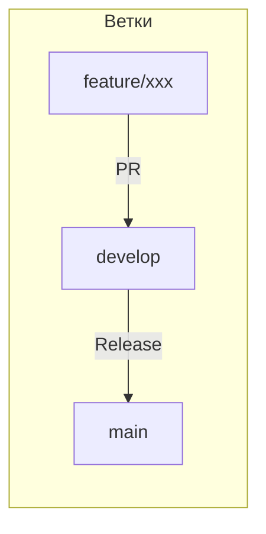

# Git Workflow

> **Тип:** Process  
> **Цель:** Описать процесс работы с Git  
> **Аудитория:** Все разработчики

## Обзор

Документ описывает модель ветвления и процесс работы с Git в проекте.

## Ветки

### Основные ветки

| Ветка | Назначение |
|-------|------------|
| `main` | Production-ready код |
| `develop` | Интеграционная ветка (staging) |

### Feature ветки

| Паттерн | Назначение |
|---------|------------|
| `feature/*` | Новая функциональность |
| `fix/*` | Исправление багов |
| `refactor/*` | Рефакторинг |
| `docs/*` | Документация |

## Workflow



### 1. Создание feature ветки

```bash
git checkout develop
git pull origin develop
git checkout -b feature/add-transaction-form
```

### 2. Разработка

```bash
# Работаем над кодом
git add .
git commit -m "feat: add transaction form component"
```

### 3. Push и PR

```bash
git push -u origin feature/add-transaction-form
# Создаём PR в develop через GitHub
```

### 4. Code Review

- PR должен быть одобрен
- Все проверки должны пройти (lint, typecheck)
- Конфликты должны быть разрешены

### 5. Merge

После одобрения PR мержится в `develop` через GitHub.

## Именование веток

### Формат

```
<тип>/<краткое-описание>
```

### Примеры

**Хорошо:**

```
feature/add-accounts-page
fix/transaction-validation
refactor/extract-hooks
docs/update-readme
```

**Плохо:**

```
new-feature          # Нет типа
feature/Add Accounts # Пробелы и заглавные
fix                  # Нет описания
```

## Правила

### Не коммитить напрямую в main/develop

Всегда через PR.

### Держать ветки актуальными

```bash
git checkout develop
git pull
git checkout feature/my-feature
git rebase develop
```

### Удалять ветки после merge

GitHub делает это автоматически, но локально:

```bash
git branch -d feature/merged-feature
```

## Pre-commit hooks

Проект использует Husky (если настроен) для:

- ESLint проверки
- Prettier форматирования
- TypeScript проверки

## Релизы

Релизы создаются при merge в `main`:

1. PR из `develop` в `main`
2. После merge — создаётся тег версии
3. (Опционально) semantic-release для автоматизации

## Частые команды

| Команда | Описание |
|---------|----------|
| `git status` | Статус изменений |
| `git diff` | Просмотр изменений |
| `git log --oneline -10` | Последние 10 коммитов |
| `git stash` | Временно сохранить изменения |
| `git stash pop` | Восстановить изменения |

## См. также

- [Соглашение о коммитах](./commit-convention.md)
- [Настройка разработки](../guides/development-setup.md)
