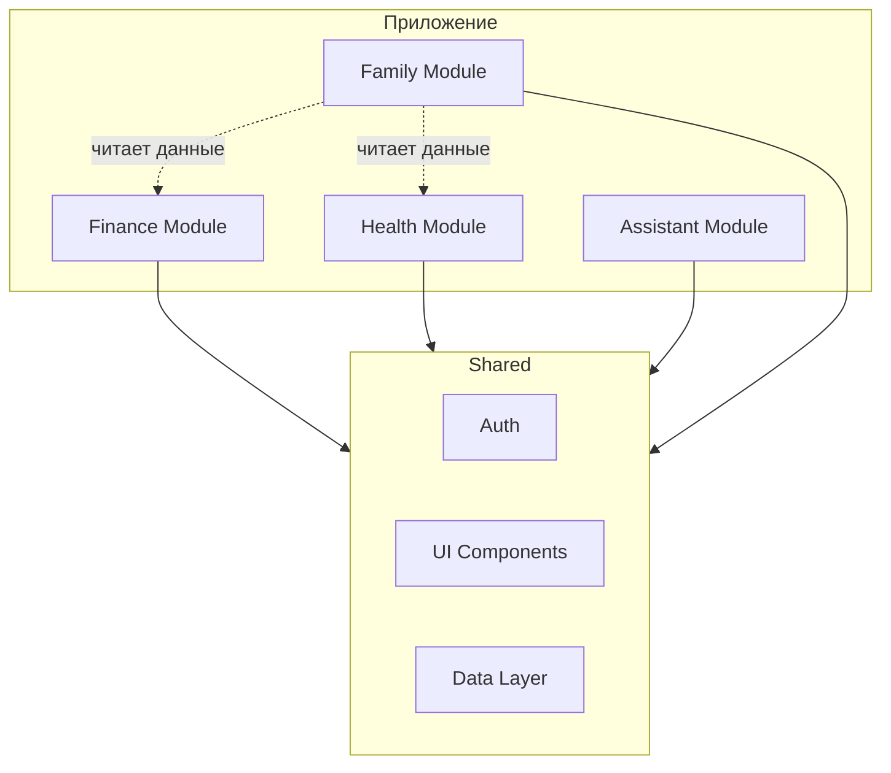

# Спецификации модулей

Обзор всех модулей приложения «Ассистент» и их текущий статус.

## Модули

| Модуль                                 | Статус      | Приоритет | Описание                                     |
| -------------------------------------- | ----------- | --------- | -------------------------------------------- |
| **[Auth](./auth/README.md)**           | In Progress | High      | Аутентификация и авторизация (Supabase Auth) |
| **[Finance](./finance/README.md)**     | Planning    | High      | Учёт доходов/расходов, статистика, подсказки |
| **[Health](./health/README.md)**       | Stub        | Medium    | Показатели здоровья, рекомендации AI         |
| **[Assistant](./assistant/README.md)** | Stub        | Medium    | Списки покупок, напоминания, уведомления     |
| **[Family](./family/README.md)**       | Stub        | Low       | Семейный режим, общие показатели             |

## Статусы

| Статус          | Описание                                         |
| --------------- | ------------------------------------------------ |
| **Stub**        | Заглушка, только базовая документация            |
| **Planning**    | Активное планирование, спецификация в разработке |
| **In Progress** | Реализация начата                                |
| **Done**        | Модуль готов                                     |

## Архитектура модулей



## Зависимости между модулями

| Модуль    | Зависит от            | Используется в |
| --------- | --------------------- | -------------- |
| Finance   | Auth                  | Family         |
| Health    | Auth                  | Family         |
| Assistant | Auth                  | —              |
| Family    | Auth, Finance, Health | —              |

## Общие компоненты

Все модули используют общие компоненты и сервисы:

- **Auth** — аутентификация и авторизация (Supabase Auth)
- **UI Components** — базовые UI компоненты (`src/components/ui/`)
- **Data Layer** — TanStack Query, Supabase клиент
- **Theme** — темы и стили

## Структура модуля

Каждый модуль имеет стандартную структуру документации:

```
specs/[module]/
├── README.md          # Обзор модуля, цели, статус
├── user-stories.md    # User stories и сценарии
├── data-model.md      # Схема данных и сущности
└── api.md             # API, hooks, интерфейсы
```

И стандартную структуру кода:

```
src/
├── components/features/[module]/   # UI компоненты модуля
├── lib/hooks/use[Module].ts        # React hooks
├── lib/types/[module].ts           # TypeScript типы
├── lib/validations/[module].ts     # Zod схемы
└── lib/query/
    ├── queries/[module].ts         # Query функции
    └── mutations/[module].ts       # Mutation функции
```

## Roadmap модулей

### Фаза 1: Finance (MVP)

1. Базовая структура и навигация
2. Счета (accounts)
3. Транзакции (income/expense/transfer)
4. Категории
5. Базовая статистика

### Фаза 2: Assistant

1. Списки покупок
2. Напоминания
3. Push-уведомления

### Фаза 3: Health

1. Базовые показатели
2. Ввод данных
3. AI рекомендации (заглушка)

### Фаза 4: Family

1. Создание семьи
2. Приглашения
3. Общие показатели

## Референс

Модуль Finance основан на реализации из Pennora:

- [reference/pennora/lib/types/](../../reference/pennora/lib/types/) — типы данных
- [reference/pennora/lib/validations/](../../reference/pennora/lib/validations/) — валидации
- [reference/pennora/components/features/](../../reference/pennora/components/features/) — компоненты
- [reference/pennora/supabase/migrations/](../../reference/pennora/supabase/migrations/) — схема БД

## См. также

- [Целевая архитектура](../concepts/target-architecture.md)
- [Roadmap](../meta/roadmap.md)
