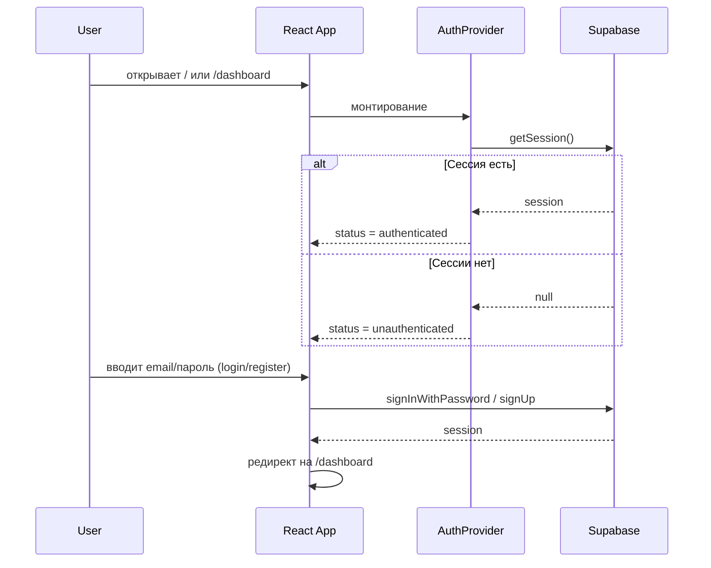

# Auth Module

## Обзор

Модуль **Auth** отвечает за аутентификацию пользователей в приложении «Ассистент».
Используется Supabase Auth (email/password) без подтверждения email, все данные
хранятся в PostgreSQL проекта Supabase.

## Цели

- Обеспечить безопасный вход/регистрацию по email и паролю.
- Защитить приватные страницы (дашборд, финансы, семья и т.д.).
- Предоставить единый слой для работы с Auth во всех модулях.

## Поддерживаемые сценарии

- Регистрация нового пользователя (`/register`).
- Вход существующего пользователя (`/login`).
- Выход из аккаунта (Logout).
- Автоматическое восстановление сессии при открытии приложения.

## Архитектура

- **Infrastructure**: `src/lib/db/supabase-client.ts` — единый Supabase клиент.
- **State**: `src/lib/stores/auth-store.ts` — Zustand store для авторизации.
- **Provider**: `src/providers/auth-provider.tsx` — синхронизация store с Supabase.
- **Routing**: `src/components/auth/protected-route.tsx` — защита роутов.
- **Pages**:
  - `src/pages/auth/login.tsx` — страница входа.
  - `src/pages/auth/register.tsx` — страница регистрации.
- **UI**:
  - `src/components/auth/logout-button.tsx` — кнопка выхода.

## Поток авторизации

## Связь с другими модулями

- Модуль **Finance** использует Auth для фильтрации данных по пользователю.
- Модуль **Assistant** и **Health** также используют Auth для разделения данных.
- Модуль **Family** опирается на Auth для связи членов семьи.

## Статус

- **Status**: In Progress
- Следующие шаги:
  - Добавить UI для отображения текущего пользователя в дашборде.
  - Добавить ограничения доступа по ролям (при необходимости).
