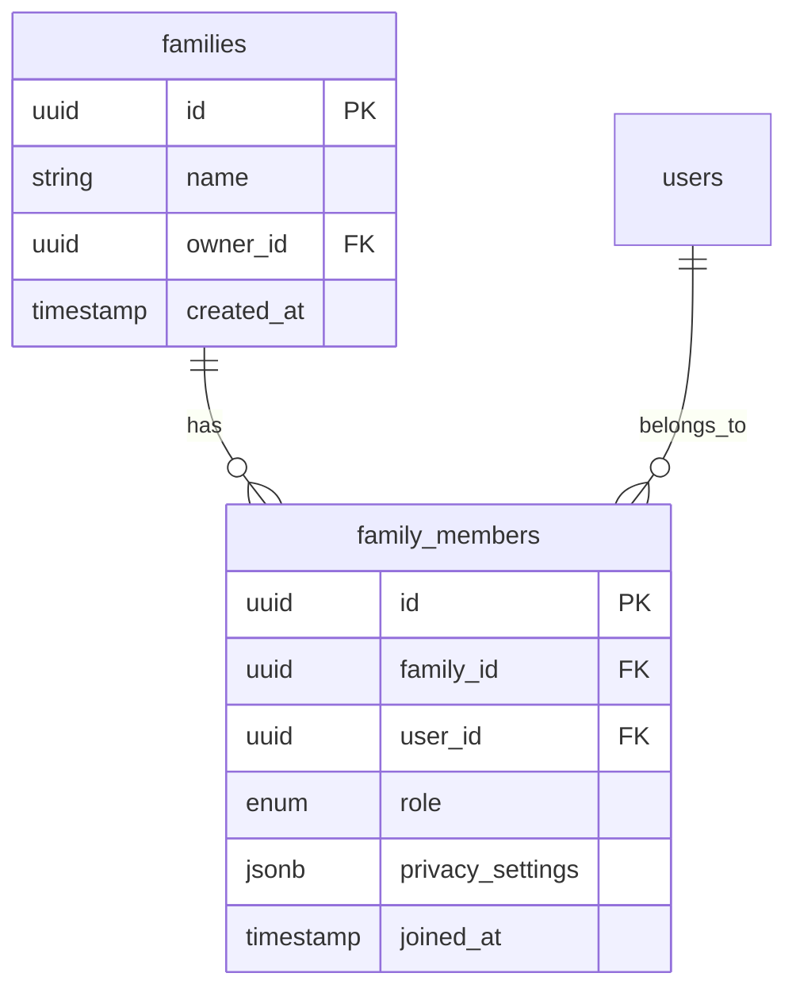

# Модуль: Family

> **Статус:** Stub  
> **Приоритет:** Low  
> **Зависимости:** Auth, Finance, Health, Assistant

## Обзор

Модуль семьи позволяет пользователям объединяться в семьи и просматривать общие показатели. В текущей версии — заглушка для будущей реализации.

## Цели

- Создание семьи и приглашение участников
- Просмотр общих финансовых показателей
- Просмотр показателей здоровья членов семьи (с разрешения)
- Общие списки и напоминания

## Scope (планируется)

### В scope

- Создание семьи
- Приглашение по email/ссылке
- Роли: owner, member
- Общая статистика финансов семьи
- Общие списки покупок
- Настройки приватности (что показывать семье)

### Вне scope

- Несколько семей для одного пользователя
- Детские аккаунты с ограничениями
- Семейные бюджеты с лимитами

## Планируемые функции

### Семья

- Создание семьи (owner)
- Приглашение членов
- Принятие/отклонение приглашения
- Выход из семьи
- Удаление семьи (только owner)

### Общие данные

- Общий баланс семьи (сумма балансов всех членов)
- Расходы семьи за период
- Списки покупок семьи
- Показатели здоровья (с разрешения)

### Приватность

- Настройка видимости финансов
- Настройка видимости здоровья
- Настройка видимости списков

## Модель данных (черновик)

## Технические заметки

- Supabase RLS для разграничения доступа
- Приглашения через Supabase Auth invite или кастомные токены
- Агрегация данных на клиенте (или Supabase functions)

## Интеграция с другими модулями

- **Finance** — читает данные счетов и транзакций членов семьи
- **Health** — читает показатели здоровья (с разрешения)
- **Assistant** — общие списки и напоминания

## Статус

Модуль находится в стадии планирования. Реализация запланирована на Фазу 4 (см. [roadmap](../../meta/roadmap.md)).

## TODO

- [ ] Детализировать user stories
- [ ] Спроектировать модель данных
- [ ] Продумать систему приглашений
- [ ] Продумать настройки приватности

## См. также

- [Обзор модулей](../README.md)
- [Roadmap](../../meta/roadmap.md)
