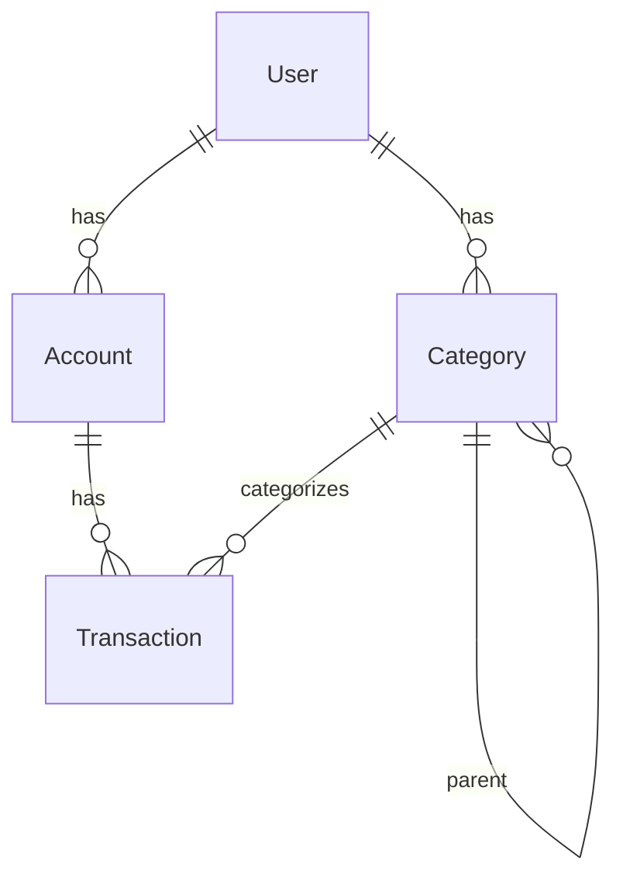

# Модуль: Finance

> **Статус:** Planning  
> **Приоритет:** High  
> **Зависимости:** Auth (Supabase)

## Обзор

Модуль финансов позволяет пользователям вести учёт доходов и расходов, просматривать статистику и получать подсказки по оптимизации бюджета. Основан на реализации из Pennora с адаптацией под SPA-архитектуру.

## Цели

- Удобный учёт доходов и расходов
- Поддержка нескольких счетов (карты, наличные, etc.)
- Категоризация транзакций
- Статистика и визуализация данных
- Мультивалютность с автоматической конвертацией

## Scope

### В scope (MVP)

- Управление счетами (создание, редактирование, удаление)
- Транзакции: доход, расход, перевод между счетами
- Категории транзакций (иерархические)
- Базовая статистика: доходы/расходы за период
- Фильтрация транзакций по дате, категории, счёту

### Вне scope (будущие версии)

- Бюджеты и лимиты по категориям
- Повторяющиеся транзакции
- Импорт из банковских выписок
- AI-подсказки по оптимизации
- Экспорт в CSV/PDF

## Ключевые экраны

| Экран | Описание |
|-------|----------|
| Dashboard | Баланс, статистика за месяц, последние транзакции |
| Transactions | Список всех транзакций с фильтрами |
| Accounts | Список счетов с балансами |
| Categories | Управление категориями |
| Statistics | Графики и диаграммы |

## User Stories

Детальные user stories описаны в [user-stories.md](./user-stories.md).

### Основные сценарии

1. **Добавление расхода** — быстрое добавление траты с категорией
2. **Добавление дохода** — фиксация поступления на счёт
3. **Перевод между счетами** — перемещение средств
4. **Просмотр статистики** — анализ расходов по категориям

## Модель данных

Детальная схема данных описана в [data-model.md](./data-model.md).

### Основные сущности

- **Account** — счёт пользователя (карта, наличные, etc.)
- **Transaction** — транзакция (доход, расход, перевод)
- **Category** — категория транзакции (иерархическая)

## API и Hooks

Детальное описание API в [api.md](./api.md).

### Основные hooks

| Hook | Описание |
|------|----------|
| `useAccounts` | CRUD для счетов |
| `useTransactions` | CRUD для транзакций с фильтрацией |
| `useCategories` | CRUD для категорий |
| `useStatistics` | Агрегированная статистика |

## Референс из Pennora

Модуль основан на реализации из Pennora:

| Что | Путь в Pennora |
|-----|----------------|
| Типы | `reference/pennora/lib/types/transaction.ts`, `reference/pennora/lib/types/category.ts` |
| Валидации | `reference/pennora/lib/validations/transactions.ts`, `reference/pennora/lib/validations/categories.ts` |
| Query | `reference/pennora/lib/query/queries/transactions.ts`, `reference/pennora/lib/query/queries/categories.ts` |
| Компоненты | `reference/pennora/components/features/transactions/`, `reference/pennora/components/features/categories/` |
| Миграции БД | `reference/pennora/supabase/migrations/` |

## Интеграция с другими модулями

- **Family** — семья может видеть общие финансовые показатели
- **Assistant** — напоминания о регулярных платежах (будущее)

## Технические заметки

- Используем TanStack Query для кеширования данных
- Оптимистичные обновления для мгновенного UI
- Supabase RLS для разграничения доступа
- Мультивалютность через конвертацию на клиенте

## Открытые вопросы

- [ ] Переносить ли бюджеты из Pennora в MVP?
- [ ] Нужна ли офлайн-поддержка в MVP?
- [ ] Какой API использовать для курсов валют?

## Документация

- [User Stories](./user-stories.md)
- [Модель данных](./data-model.md)
- [API](./api.md)

## См. также

- [Обзор модулей](../README.md)
- [Целевая архитектура](../../concepts/target-architecture.md)
