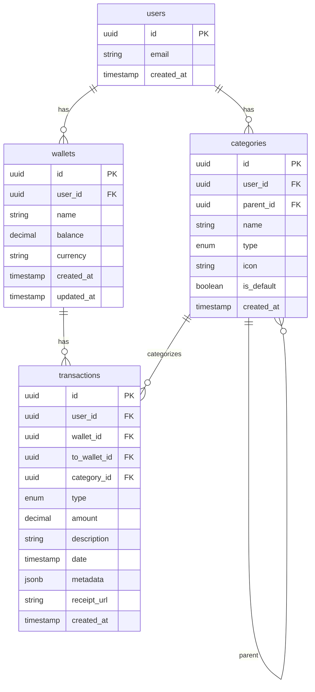

# Finance: Модель данных

> 📋 **Статус: Спецификация**
> Схема данных основана на Pennora. Таблицы будут созданы при настройке Supabase.

Схема данных для модуля финансов. Основана на реализации из Pennora с упрощениями для MVP.

## ER-диаграмма



## Таблицы

### wallets

Счета пользователя (карты, наличные, etc.).

| Поле       | Тип           | Обязательное | Описание                          |
| ---------- | ------------- | ------------ | --------------------------------- |
| id         | uuid          | Да           | Первичный ключ                    |
| user_id    | uuid          | Да           | FK на users                       |
| name       | text          | Да           | Название счёта                    |
| currency   | text          | Да           | Код валюты (RUB, USD, etc.), text |
| balance    | decimal(15,2) | Да           | Текущий баланс                    |
| color      | text          | Нет          | Цвет для UI                       |
| icon       | text          | Нет          | Иконка для UI                     |
| created_at | timestamptz   | Да           | Дата создания (UTC)               |
| updated_at | timestamptz   | Да           | Дата обновления (UTC)             |

**Индексы:**

- `accounts_user_id_idx` — по user_id

**RLS:**

- Пользователь видит только свои счета
- Пользователь может создавать/изменять/удалять только свои счета

### categories

Категории транзакций (иерархические).

| Поле       | Тип          | Обязательное | Описание                                   |
| ---------- | ------------ | ------------ | ------------------------------------------ |
| id         | uuid         | Да           | Первичный ключ                             |
| user_id    | uuid         | Нет          | FK на users (null для системных категорий) |
| parent_id  | uuid         | Нет          | FK на categories (родительская)            |
| name       | varchar(100) | Да           | Название категории                         |
| type       | enum         | Да           | Тип: `income`, `expense`                   |
| icon       | varchar(50)  | Нет          | Название иконки (lucide)                   |
| color      | text         | Нет          | Цвет для UI                                |
| is_default | boolean      | Нет          | Признак дефолтной категории для онбординга |
| created_at | timestamptz  | Да           | Дата создания                              |

**Индексы:**

- `categories_user_id_idx` — по user_id
- `categories_parent_id_idx` — по parent_id
- `categories_type_idx` — по type

**RLS:**

- Пользователь видит системные + свои категории
- Пользователь может изменять/удалять только свои категории

### transactions

Транзакции (доходы, расходы, переводы).

| Поле         | Тип           | Обязательное | Описание                                         |
| ------------ | ------------- | ------------ | ------------------------------------------------ |
| id           | uuid          | Да           | Первичный ключ                                   |
| user_id      | uuid          | Да           | FK на users                                      |
| wallet_id    | uuid          | Да           | FK на wallets (счёт списания/зачисления)         |
| to_wallet_id | uuid          | Нет          | FK на wallets (для переводов)                    |
| category_id  | uuid          | Нет          | FK на categories                                 |
| type         | enum          | Да           | Тип: `income`, `expense`, `transfer`             |
| amount       | decimal(15,2) | Да           | Сумма (всегда положительная)                     |
| description  | text          | Нет          | Описание транзакции                              |
| date         | timestamptz   | Да           | Дата/время транзакции (UTC)                      |
| metadata     | jsonb         | Нет          | Доп. данные (курс валюты, метки, сервисные поля) |
| receipt_url  | text          | Нет          | URL файла чека в Supabase Storage                |
| created_at   | timestamptz   | Да           | Дата создания                                    |

**Индексы:**

- `transactions_user_id_idx` — по user_id
- `transactions_account_id_idx` — по account_id
- `transactions_category_id_idx` — по category_id
- `transactions_date_idx` — по date
- `transactions_type_idx` — по type

**RLS:**

- Пользователь видит только свои транзакции
- Пользователь может создавать/изменять/удалять только свои транзакции

## Типы (Enums)

> В текущей схеме Assistant типы `type` для категорий и транзакций реализованы как `text` с `CHECK`‑ограничениями (`income` / `expense` / `transfer`), без отдельных enum‑типов. Для Pennora по-прежнему используются enum‑типы, см. `reference/pennora/lib/db/supabase/types.ts`.

## TypeScript типы

```typescript
// Счёт (wallet)
interface Wallet {
  id: string;
  user_id: string;
  name: string;
  currency: string;
  balance: number;
  color?: string;
  icon?: string;
  created_at: string;
  updated_at: string;
}

// Типы категорий
type CategoryType = "income" | "expense";

interface Category {
  id: string;
  user_id: string | null;
  parent_id: string | null;
  name: string;
  type: CategoryType;
  icon: string | null;
  color: string | null;
  is_default: boolean;
  created_at: string;
}

// Типы транзакций
type TransactionType = "income" | "expense" | "transfer";

interface Transaction {
  id: string;
  user_id: string;
  wallet_id: string;
  to_wallet_id: string | null;
  category_id: string | null;
  type: TransactionType;
  amount: number;
  description: string | null;
  date: string;
  receipt_url: string | null;
  metadata: Record<string, unknown>;
  created_at: string;
}
```

## Системные категории

При регистрации пользователя создаются базовые категории:

### Расходы

| Название    | Иконка          | Подкатегории                  |
| ----------- | --------------- | ----------------------------- |
| Еда         | utensils        | Продукты, Рестораны, Доставка |
| Транспорт   | car             | Топливо, Общественный, Такси  |
| Жильё       | home            | Аренда, Коммуналка            |
| Покупки     | shopping-bag    | Одежда, Электроника           |
| Развлечения | gamepad         | Кино, Игры, Подписки          |
| Здоровье    | heart           | Аптеки, Врачи                 |
| Другое      | more-horizontal | —                             |

### Доходы

| Название | Иконка          |
| -------- | --------------- |
| Зарплата | briefcase       |
| Фриланс  | laptop          |
| Подарки  | gift            |
| Другое   | more-horizontal |

## Валюты

Поддерживаемые валюты (из Pennora):

| Код | Название            | Символ |
| --- | ------------------- | ------ |
| RUB | Российский рубль    | ₽      |
| USD | Доллар США          | $      |
| EUR | Евро                | €      |
| GBP | Фунт стерлингов     | £      |
| KZT | Казахстанский тенге | ₸      |
| UAH | Украинская гривна   | ₴      |

## Миграции

Базовые миграции находятся в `reference/pennora/supabase/migrations/`:

- `20250101000000_create_default_categories.sql` — системные категории
- Схема таблиц — в других миграциях

## Референс

- Типы из Pennora: `reference/pennora/lib/types/`
- Валидации: `reference/pennora/lib/validations/`
- Миграции: `reference/pennora/supabase/migrations/`
